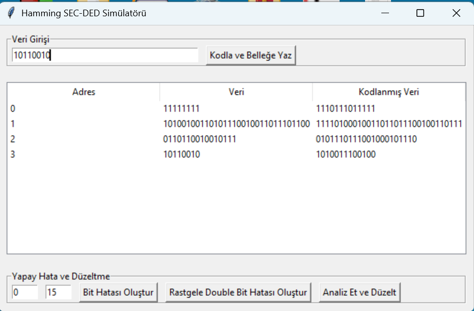
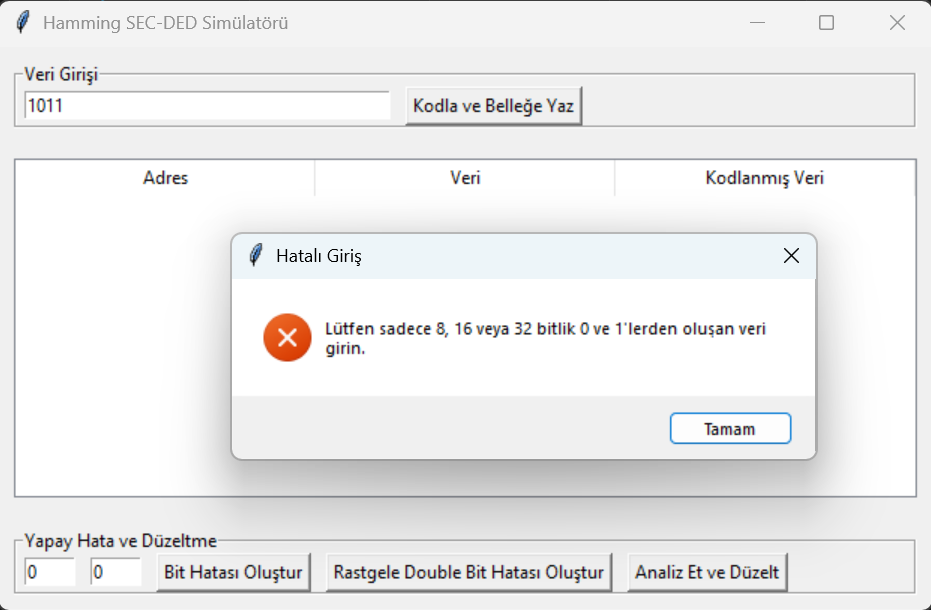
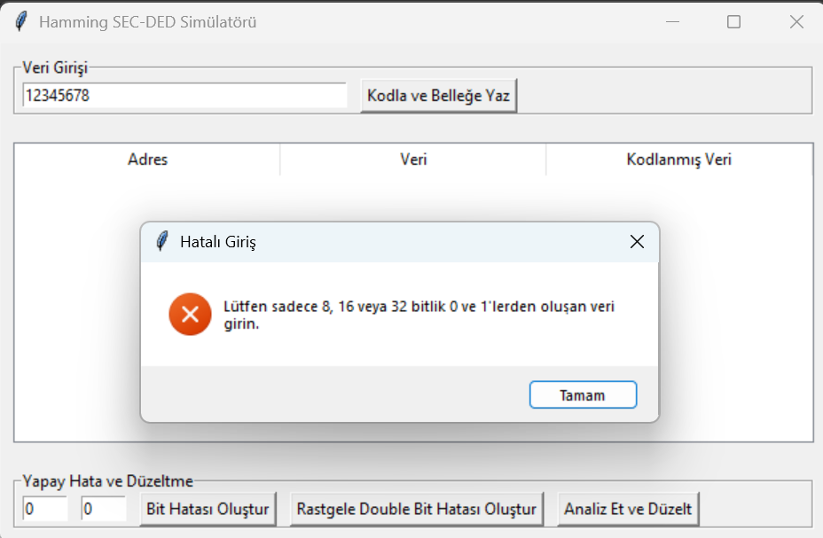
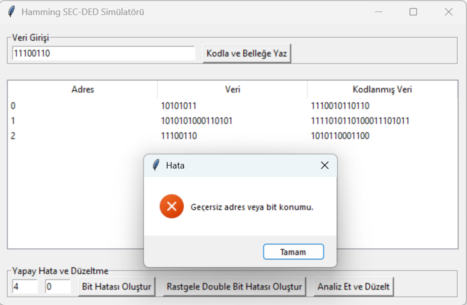
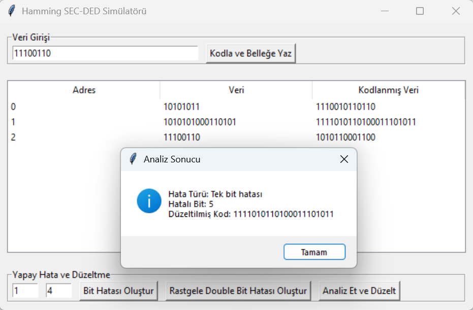
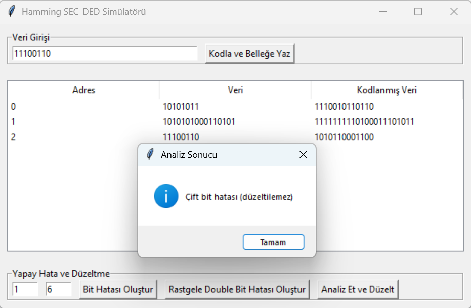

# Hamming SEC-DED (Single Error Correcting - Double Error Detecting) Simülatörü

Bu proje, BTÜ Bilgisayar Mühendisliği BLM230 Bilgisayar Mimarisi dersi kapsamında, hata düzeltme kodlarını anlamak ve uygulamak amacıyla geliştirilmiştir. Hamming SEC-DED algoritması kullanılarak hem tek bit düzeltme, hem de çift bit tespit etme yapılmaktadır.

Bu çalışma, 8, 16 ve 32 bitlik veriler üzerinde Hamming SEC-DED algoritmasını uygulayan kullanıcı dostu bir grafiksel simülatördür. Python programlama dili ve tkinter arayüz kütüphanesi kullanılarak geliştirilmiştir.

---

## Özellikler

- 8, 16 veya 32 bitlik veriyi Hamming kodu ile belleğe yazma  
- Tek bit hatasını tespit edip otomatik düzeltme  
- Çift bit hatasını algılama (düzeltilemez olarak bildirir)  
- Bellekten veri okuma ve bit bozma  
- GUI üzerinden tüm işlemleri görsel olarak yapabilme  
- Simülasyonun çalışmasını gösteren demo video

---

## Nasıl Çalışır?

> Thinker kütüphanesi kullanılarak kullanıcı dostu bir arayüz geliştirilmiştir

> Girilen veriyi kodla ve belleğe yaz butonuna tıkladıktan sonra belleğe kaydolur.
> Uygulama sadece 8, 16 veya 32 lik bitlerin girilmesine izin verir. Aksi takdirde uyarı ekranı gönderir.
  

> Arayüzün sol alt köşesinde bulunan girdilere adres ve bit konumu girilir.
> Eğer girdiğiniz adres ya da bit konumu bellekte bulunmuyorsa hata mesajı gönderir.

> Bellekte bulunan bir adres ve konum girildikten sonra 'Bit Hatası Oluştur' butonuna basılarak o konumda tek bitlik hata oluşturulur.
> Daha sonra 'Analiz Et Ve Düzelt' butonuna basıldığında, hatalı bit tespit edilir ve düzeltilir.

> Eğer aynı adreste iki adet bit hatası oluşturulmuş ise Çift Bit Hatası mesajı verilir

> Ayrıca bir adres girilerek 'Rastgele Double Bit Hatası Oluştur' butonuna basılırsa, rastgele iki adet konumda bit hatası oluşturur. 

---

## Demo Videosu

Simülatörün çalışma videosunu [buradan](https://youtu.be/pI2KC0LIOi8) izleyebilirsiniz.

---
